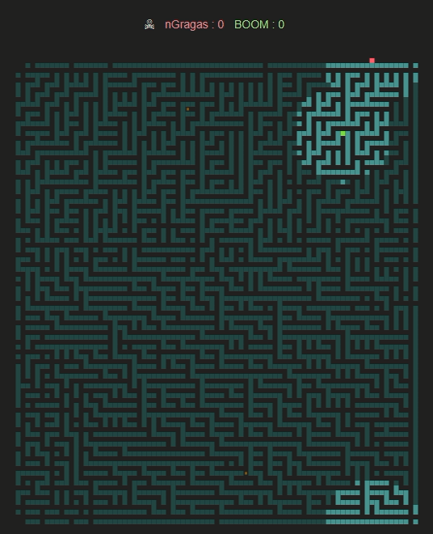
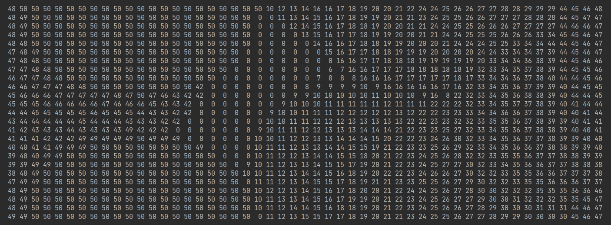
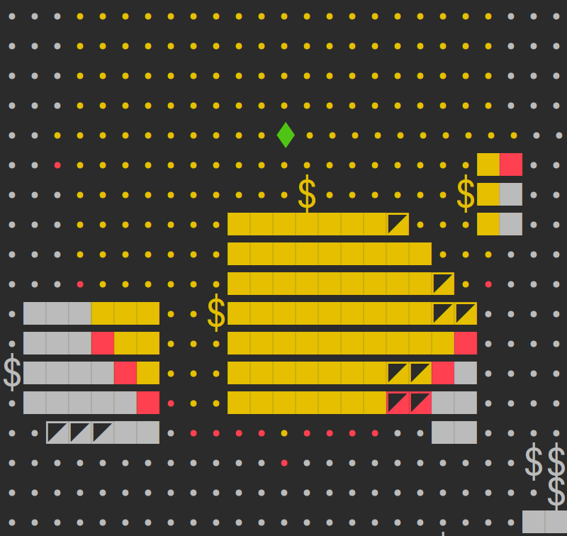
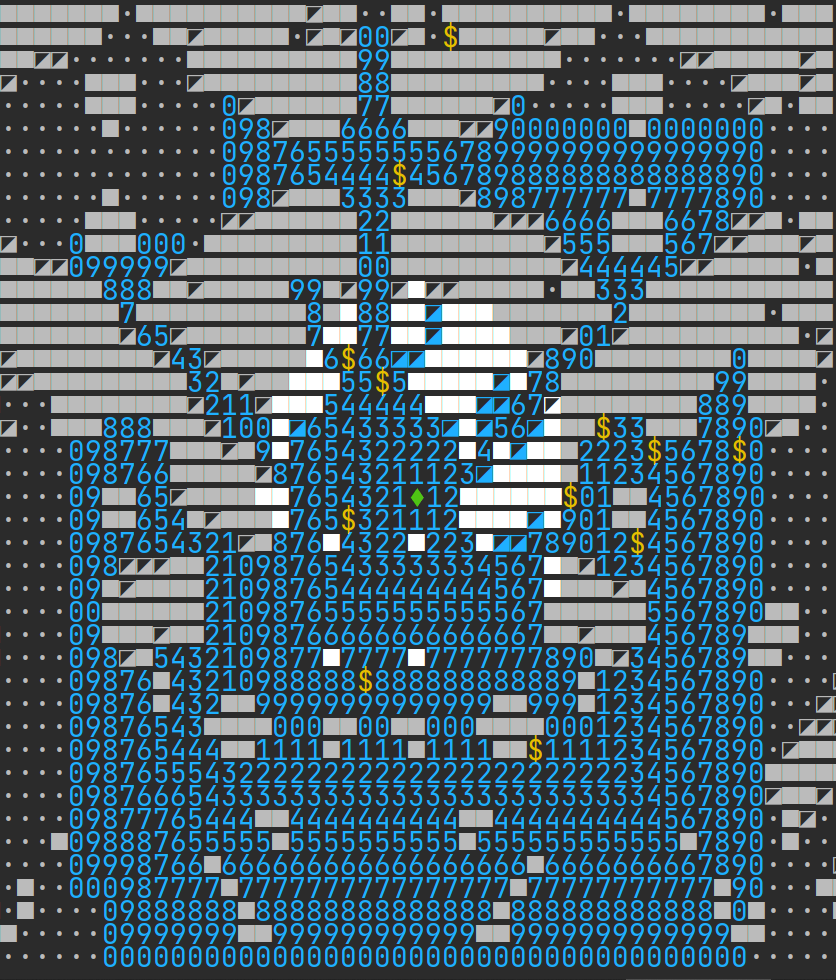
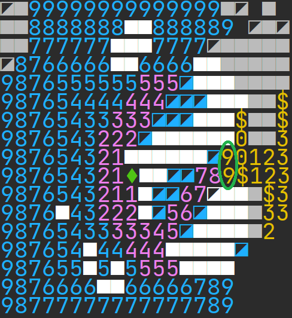
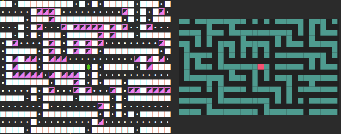
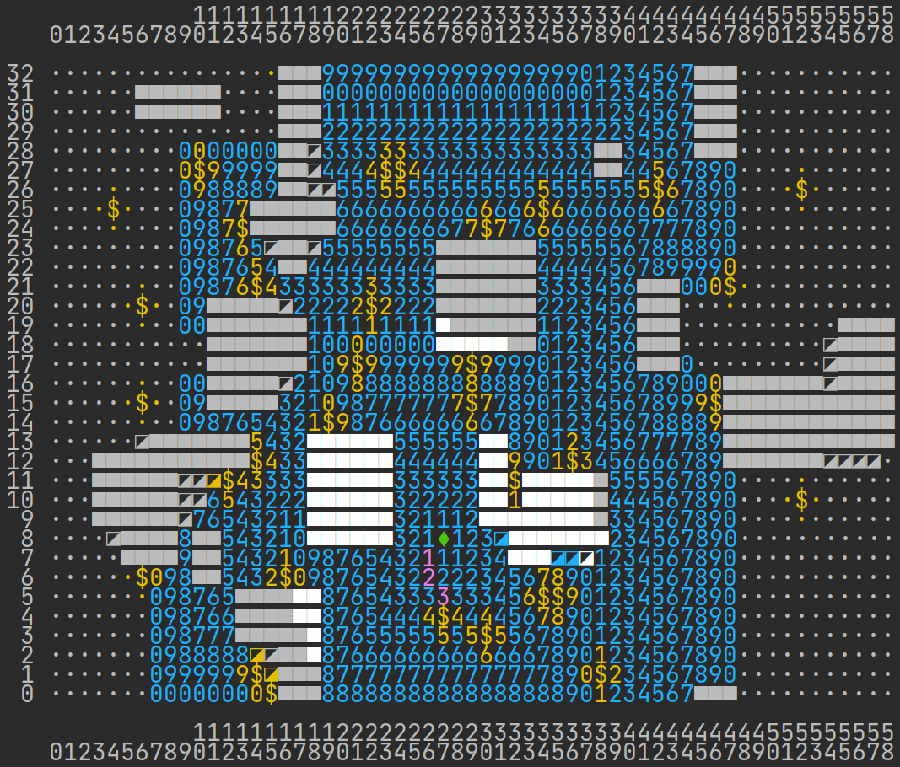
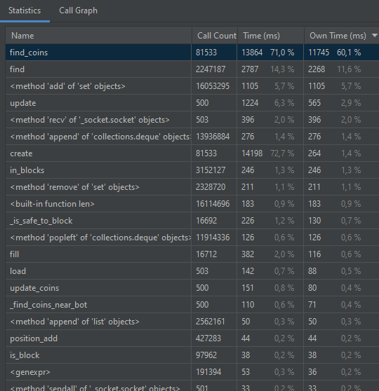

## 🏆🤖 Croc Bot Battle (2022) Post Mortem - nGragas

Соревнование по написанию игрового бота от [Croc](https://brainz.croc.ru/) (_[основной репозиторий соревнования](https://github.com/nypi/hypernull)_).

На неделю я выпал из обычной жизни, пробуя реализовать различные идеи и решения, которые помогли боту занять 1 место в финале.

Спасибо за это приключение создателям и организаторам, которые хорошо сделали свою работу.

В этом пост-мортеме (так называют разбор прошлого опыта) - я расскажу детали реализации и интересные сопутствующие моменты.

     
    <b>nGragas vs BOOM</b> 
    <i>матч проигран, но интересен счётом: 54 vs 55</i>

## Содержание

1. [Выбор языка](#language)
2. [Бот](#bot) \
    2.1. [Поведение: Исследователь](#explorer) \
    2.2. [Поведение: Сборщик монет](#coins_finder) \
    2.3. [Поведение: Бей или беги](#battle)
3. ["Фишки" / идеи / техники](#tips) \
    3.1. [Поиск пути - BFS](#bfs) \
    3.2. [Поиск пути - A*](#a_star) \
    3.3. [DeadEndFiller - "залепливатель" тупиков](#dead_end_filler) \
    3.4. [Canvas - визуализатор карты](#canvas) \
    3.5. [Автоплеер в конце матча](#autoplayer) \
    3.6. [Секундомер раундов](#stopwatch) \
    3.7. [Режим Benchmark](#benchmark) \
    3.8. [Супербуст скорости Python - PyPy](#pypy) \
    3.9. [Оптимизации и PyCharm Profiler](#optimizations) \
    3.9. [Моддинг Сервера](#modding)

## Выбор языка
### 🐍 Python

Почему? Идеален, чтобы пробовать идеи - не жалея удалять код и быстро писать новый.

Одна проблема - придётся идти на компромисс со сложностью алгоритмов и выдумывать оптимизации, чтобы вписаться в регламент "меньше секунды на ход" (об этом далее).

Отправной точкой был взят [Python Starter Bot](https://github.com/nypi/hypernull/tree/master/starter-bot-python), написанный до этого мной же, который скрывает общение с сервером - остаётся лишь написать логику.

## Бот

Компоненты разбил на отдельные классы:
- [Map](bot/map.py) (карта)
- [Explorer](bot/explorer.py), [CoinsFinderGraph](bot/coins_finder_graph.py) (поведения)
- [BFS](bot/bfs.py), [AStar](bot/a_star.py) (алгоритмы поиска пути)
- [DeadEndFiller](bot/dead_end_filler.py) ("залепливатель" тупиков и ниш)
- [Canvas](bot/canvas.py) (визуализатор карты)

### Поведение: Исследователь
[bot/explorer.py](bot/explorer.py)

**Ключевая идея - искать лучшее направление, которое откроет максимальное число максимально давно посещённых точек.**

Это поведение активно только если в зоне видимости нет ни одной монеты.

#### Алгоритм:

Ведётся карта с отметками раундов, когда точку последний раз видел бот.

     
    <b>карта last_seen - дамп с раунда #50</b> 
    <i>
        Круг с числами текущего раунда (50) показывает зону видимости бота. 
        Числа 0 - это неисследованная территория, бот не обновил отметку этих точек. 
        По шлейфу увеличения числа можно определить траекторию перемещения - бот движется слева направо
    </i>

Также, ещё до старта матча - создаются 8 наборов точек по 8 направлениям движения, где каждый набор - это смещения от позиции бота, которые будут открыты при перемещении бота по выбранному направлению (выглядят как дуги-обводки вокруг зоны видимости).

     
    <b>
        жёлтый цвет: зона видимости 
        красный цвет: точки, которые будут открыты при перемещении бота на один шаг вниз 
    </b>
    <i>
        эти "открываемые" точки просчитываются до старта матча по каждому из 8 направлений
    </i>

Бот оценивает открываемые каждым направлением точки, суммируя их рейтинг по формуле:

    cur_round = match_info.round_number    # номер текущего раунда
    last_seen_round = last_seen[y][x]      # номер раунда, когда последний раз видел эту точку
    pt_score = cur_round - last_seen_round # рейтинг точки
    direction_score = sum(pts_scores)      # рейтинг направления движения

Это круто работает в большинстве случаев - бот стремится исследовать карту и предпочитает повторно посещать только те места, где давно не был - ведь там могли появиться монеты.

Но если во время исследования позади бота появится монета, то вернувшись собрать её - он не продолжит прошлое направление исследования - т.к. будет считать, что там уже только что был (оценивает направления только на один ход).

Были попытки начислять дополнительный рейтинг точкам в направлении неизвестных точек карты, но качественно реализовать не удалось.

### Поведение: Сборщик монет
[bot/coins_finder_graph.py](bot/coins_finder_graph.py)

**Ключевая идея - найти путь сбора монет - на основе лучшего отношения количества монет к затраченным для сбора шагам.**

Идея очень похожа на [задачу коммивояжёра](https://ru.wikipedia.org/wiki/Задача_коммивояжёра), но усложнена тем, что у монет есть радиус сбора, а значит количество возможных точек пути и вариантов обхода кардинально растёт.
> _...для 15 городов существует 43 миллиарда маршрутов и для 18 городов уже 177 триллионов..._

#### Алгоритм:

Создаём граф, где бот и точки сбора - это вершины, а расстояние в шагах между ними - это вес соединяющих рёбер:
1) Ищутся ближайшие к боту 3 точки сбора ближайших 3 монет
2) По каждой точке сбора монеты - ищутся ближайшие 2 точки сбора 2 ближайших монет
3) Рекурсивно повторяется **2)**, вплоть до цепочки из 5 **различных** монет

По итогу получаем набор рёбер "от монеты/точки-сбора"-"до монеты/точки-сбора" с весом-расстоянием.

     
    <b>
        визуализация полного перебора возможных путей 
    </b>
    <i>
        (<a href="https://en.wikipedia.org/wiki/Travelling_salesman_problem">Travelling salesman problem</a>)
    </i>

Дальше перебираем все возможные комбинации, находя лучшее отношение количества монет к затраченным шагам.

**Q:** Почему именно такие цифры: 3 ближайших к боту, 2 ближайших к монете, цепочка до 5 монет?

**A:** Python 😑 Это всё, что удалось впихнуть, не выходя за "безопасные" пределы ~0.3 сек за ход.  Он способен за секунду перебрать всего до миллиона вариантов - у меня он перебирает в пике до 300 тысяч за ход. Лучшие параметры подбирал через прогоны [benchmark](#benchmark) (далее).

Получив оптимальный маршрут - знаем к какой точке сбора монеты боту стоит двигаться. Но и к ней можно проложить различные маршруты, поэтому:
1) рекурсивно собираем все возможные точки движения от точки сбора к боту (через восстановление пути **BFS**)
2) получаем набор допустимых направлений следующего шага бота
3) выбираем лучшее направление, закинув этот набор в алгоритм [поведения Исследователя](#explorer) - чтобы по пути к монете открыть максимальное число максимально давно посещённых точек

### Поведение: Бей или беги
Не реализовал. Бот ничего не знает о соперниках.

Всё время работы над ботом отдал на эффективность исследования и сбора, делая ставку на то, что соперники не опасны, если исследование и сбор реализовать отлично. Ставка оправдалась (а может и повезло).

Так как соревнование проходило в формате 1 на 1, и рейтинг вёлся победами - не было смысла в агрессивном поведении бота для дополнительных монет.

## "Фишки" / идеи / техники

### Поиск пути - BFS ([поиск в ширину](https://ru.wikipedia.org/wiki/Поиск_в_ширину))
[bot/bfs.py](bot/bfs.py)

Основа основ и главный пожиратель CPU (~65-70%).

     
    <b>
        ярко-белые блоки: зона видимости 
        синие цифры: зона BFS
    </b> 
    <i>(количество шагов от бота % 10)</i>

Каждый ход - на 20 шагов вокруг бота строится **BFS**.

Благодаря этому бот знает - сколько шагов до каждой точки сбора каждой монеты.

При генерации графа [сбора монет](#coins_finder) - бот рекурсивно строит **BFS** от каждой(!) точки сбора монеты до ближайших 2 точек сбора монет, которых нет в цепочке текущего маршрута сбора монет (либо на расстояние 10 клеток).

**За раунд строятся до 600 BFS из различных стартовых точек**.

Здесь, есть некое поле для оптимизации - часто BFS строятся повторно для той же точки сбора монеты, но правда уже с другим набором "игнорируемых" монет (которые уже есть в цепочке перебираемого варианта маршрута).

### Поиск пути - A* ([A Star](https://ru.wikipedia.org/wiki/A*))
[bot/a_star.py](bot/a_star.py)

Пробовал **A*** в экспериментах для поиска пути к монетам, а также к скрытым точкам карты, но в итоге отказался. Этот алгоритм быстро находит путь к конкретной точке, но проигрывает BFS, если таких точек большое множество.

     
    <b>
        BFS vs A* до ближайшей монеты 
    </b>
    <i>
        синие цифры: столько точек обошёл <b>BFS</b> 
        фиолетовые: столько обошёл <b>A*</b> 
        (важно - для <b>A*</b> необходимо знать целевую точку)
    </i>

Класс-алгоритм реализован, но не задействован в логике бота.

### DeadEndFiller - "залепливатель" тупиков и ниш
[bot/dead_end_filler.py](bot/dead_end_filler.py)

Оптимизатор для исследования лабиринтов и прокладывания пути - анализирует точки карты на тупики, проставляя в них свои блоки - чтобы ни BFS, ни бот не интересовались ими.

     
    <b>
        фиолетовые блоки - работа DeadEndFiller 
    </b>
    <i>блоки ставятся даже на поворотах, чтобы бот срезал углы</i>

Алгоритм подсчитывает количество блоков вокруг точки и если их больше 3 - анализирует можно ли проставить в неё блок, не перекрывая при этом проход.

### Canvas - визуализатор карты
[bot/canvas.py](bot/canvas.py)

Для отладки важно оценивать, что происходит - чтобы проверять исправность логики и работу идей.

    

Здесь можно увидеть:
- линейки X и Y для поиска координат
- зелёная точка игрока (♦)
- монеты с их радиусом сбора
- зона видимости (ярко-белые блоки)
- зона просчёта BFS (синие цифры)
- "залепленные" тупики и ниши (блоки ◪)
- зона пути A* (фиолетовые цифры)

Всё удалось реализовать через удобный интерфейс: даётся базовый пустой холст (2D массив точек), и мы можем рисовать на нём слоями.

Слои могут быть как данными (символы/цифры), которые перерисуют точки, так и подсветкой определённых координат.

Например:

    def print_canvas(self) -> None:
        self.bfs.export(self.canvas.grid)                              # слой шагов от BFS
        self.map.export(self.canvas.grid)                              # слой символов карты
        self.canvas.highlight(self.map.visible, Color.LIGHT_GRAY)      # подсветка точек зоны видимости
        self.canvas.highlight(self.bfs.nodes.keys(), Color.BLUE)       # подсветка точек BFS
        self.canvas.highlight(self.map.coins_map.keys(), Color.YELLOW) # подсветка точек зоны сбора монет
        self.canvas.highlight(self.a_star.nodes.keys(), Color.PURPLE)  # подсветка точек A*
        self.canvas.highlight(self.a_star.last_path, Color.PURPLE)     # подсветка точек A*
        self.canvas.highlight([self.pos], Color.GREEN)                 # подсветка позиции бота
        self.canvas.highlight(self.opponents, Color.RED)               # подсветка соперников
        self.canvas.print()                                            # вывод на экран

1) Вначале кладём слой шагов от BFS (цифры)
2) Поверх слой символов с карты - они перезапишут всё, кроме пустых точек карты, где останутся шаги от BFS
3) Дальше опять же слоями - подсветим точки зоны видимости
4) Потом подсветим клетки BFS (они шире зоны видимости, поэтому перекрасят всё видимое, но кроме блоков, т.к. на блоках BFS нет)
5) Потом подсветим монеты, и т.д.

То есть последующие слои перекрашивают предыдущие.\
Слои можно менять местами / отключать, формируя желаемый вид.

Наглядно и удобно. Этот визуализатор - моя главная приятность и гордость:)))

### Автоплеер в конце матча
[open_log_player.py](open_log_player.py)

Чтобы смотреть, как бот отыграл, не делая лишних кликов - после сыгранного матча программа бота автоматически запускает плеер, которому аргументом передаётся самый новый файл из директории серверных логов.

### Секундомер раундов
[bot/timing.py](bot/timing.py)

Обёртка, чтобы засекать время.\
Добавив к `on_update()` - узнаю время, затраченное на раунд и вывожу в конце матча:

    Time: .000 - .250 (round #268)
    Average: .032

Сразу вижу какой раунд оказался самым "тяжёлым", и сколько времени он занял.

### Режим Benchmark
[benchmark.py](benchmark.py)

Как проверить эффективность новой идеи? \
Сверить в абсолютно одинаковых условиях со старой.

Задумка: прогнать бота по всем доступным картам, собрав результат, который можно будет сравнивать.

Пример вывода **benchmark**:

    map 177 (2_1), 171 (2_2), 159 (2_3), 176 (2_4), 165 (2_5), 142 (4_1), 154 (4_2), 153 (4_3), 135 (4_4), 125 (6_1), 79 (6_2), 83 (6_3), 162 (6_4), 150 (6_5), 107 (6_6), 167 (6_7), 142 (6_8), 116 (6_9)
    - MinMax: 79 (6_2) - 177 (2_1)
    - Total: 2563
    maze 54 (12_1), 70 (12_2), 50 (12_3), 37 (12_4), 24 (12_5), 15 (12_6), 91 (6_1), 147 (6_2), 135 (6_3), 90 (9_1), 84 (9_2), 94 (9_3)
    - MinMax: 15 (12_6) - 147 (6_2)
    - Total: 891
    random 167 (2_1), 153 (2_2), 153 (3_1), 177 (3_2), 153 (4_1), 161 (4_2), 128 (4_3), 138 (5_1), 163 (5_2), 165 (6_1), 156 (6_2)
    - MinMax: 128 (4_3) - 177 (3_2)
    - Total: 1714
    ===== results =====
    MinMax coins: 15 (maze_12_6) - 177 (random_3_2)
    TOTAL COINS: 5168
    --------------------------------
    Time: 1.02 - 15.82 (167, 'random_2_1')
    Average: 6.70

Видим различные категории карт _(map, maze, random)_, их имена _(2_1, 2_2, ...)_ и набранное количество монет - на конкретной карте, сумма в категории карт, и общая сумма.

Также - затраченное время на игру (показывает самую "тяжёлую" карту).

**Важно!** Чтобы режим **benchmark** работал по своей задумке - необходимо на стороне сервера зафиксировать **random seed** и запускать карты не рандомно, а последовательно (см. [Моддинг сервера](#modding)).

Я тестировал новые идеи по 3 прогонам с тремя разными **random seed** (ставил 0, 1 и 2), составляя итоговые оценки по сумме собранных монет:

    TOTAL COINS 0: 5168
    TOTAL COINS 1: 5083
    TOTAL COINS 2: 5138

### Супербуст скорости Python - PyPy

Все знают самый популярный дистрибутив `Python`, который так и называется (основан на **CPython**). Но есть его скоростной аналог - `PyPy`.\
**С ним бот получил ускорение в 3-4 раза**!

Единственный недостаток PyPy - отставание в версиях: уже ~10 месяцев как выпущен Python 3.10, скоро выйдет 3.11, однако PyPy пока только версии 3.9.

Из того, что не хватает от версии 3.10 - это аннотации типов используя пайпы, но их можно подключить, добавив в начале `.py` файлов:
`from __future__ import annotations`

###  Оптимизации и PyCharm Profiler

Профилировщик - суперполезная вещь для оптимизации кода.\
Один клик в [PyCharm Professional](https://www.jetbrains.com/help/pycharm/profiler.html) - и получаем табличку, которая показывает на что уходит время:

     
    <b>
        PyCharmPro profiler одного матча (500 раундов) 
    </b>
    <i>
        <b>Call Count</b> - количество вызов функции 
        <b>Time</b> - общее время нахождения функции в стеке вызовов 
        <b>Own Time</b> - время нахождения в самой функции 
        т.е. если функция вызвала внутри себя другую - <b>Own Time</b> перестаёт считаться, 
        а <b>Time</b> продолжает
    </i>

Благодаря пробам/экспериментам на основе этих замеров - удалось ускорить код в несколько раз.

Основные способы ускорения:
- делать предрасчёты часто-используемого
> так у меня появились предрассчитанные наборы "8 соседних точек" по каждой точке на карте, вместо получения координат-соседей добавлением +/-1 к X/Y, **что дало +25%**\
> [bot/neighbours_cache.py](bot/neighbours_cache.py)

> ...и наборы точек XY смещений образующие зоны видимости и сбора на основе их радиусов\
> [bot/area_mask.py](bot/area_mask.py)

- использовать оптимальные структуры (напр. `deque` для очереди, вместо `list`)
- упрощать структуры (напр. Named Tuple -> Tuple)
- инлайнить вызовы однострочных функций

###  Моддинг Сервера

Для удобства и корректной работы **benchmark** - код сервера для локального тестирования был подправлен.

- **Random Seed** задавал вручную: _server/HyperNull.java_

<pre>private MatchConfig buildMatchConfig(MatchMode mode, MatchMap map) {
    return MatchConfig.newBuilder()
            .setRandomSeed(0)
            ...`</pre>

- выводил название карты перед стартом матча и сделал последовательный запуск карт, вместо случайного
> _server/MapStore.java_ - вместо обычного списка карт `MapStore.maps` сделал ассоциативный массив `имя_карты: карта` и завёл счётчик с инкрементом для последовательного запуска

- уменьшил время ожидания между запусками матчей: _server/HyperNull.java_ `Thread.sleep(100)` вместо `1_000`

- упростил вывод сервера в _AsciiMatchPrinter.java_ (вывод раз в 100 раундов, без ASCII карты)
---
Это всё, спасибо за внимание :)

_[Артем **nGragas** Корников](https://t.me/Rush_iam) для [Croc Bot Battle](https://brainz.croc.ru/hello-work)_